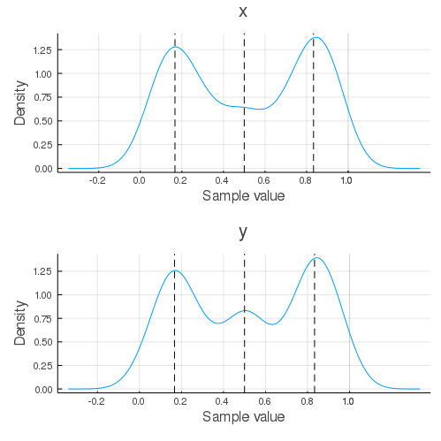

# NestedSamplers.jl

[](https://github.com/turinglang/NestedSamplers.jl/actions)
[](https://juliaci.github.io/NanosoldierReports/pkgeval_badges/report.html)
[](https://codecov.io/gh/turinglang/NestedSamplers.jl)

A Julian implementation of single- and multi-ellipsoidal nested sampling algorithms using the [AbstractMCMC](https://github.com/turinglang/abstractmcmc.jl) interface.

This package was heavily influenced by [`nestle`](https://github.com/kbarbary/nestle), [`dynesty`](https://github.com/joshspeagle/dynesty), and [`NestedSampling.jl`](https://github.com/kbarbary/NestedSampling.jl).


## Installation

To use the nested samplers first install this library

````julia

julia> ]add NestedSamplers
````


## Usage

The samplers are built using the [AbstractMCMC](https://github.com/turinglang/abstractmcmc.jl) interface. To use it, we need to create a `NestedModel`.


````julia
using NestedSamplers
using Distributions

# eggbox likelihood function
tmax = 3π
function logl(x)
    t = @. 2 * tmax * x - tmax
    return 2 + cos(t[1]/2) * cos(t[2]/2)^5
end
priors = [
    Uniform(0, 1),
    Uniform(0, 1)
]
# or equivalently
prior_transform(X) = X
# create the model
model = NestedModel(logl, priors); # or model = NestedModel(logl, prior_transform)
````


now, we set up our sampling using [StatsBase](https://github.com/JuliaStats/StatsBase.jl)

````julia
using StatsBase: sample, Weights
using MCMCChains: Chains

# create our sampler
# 2 parameters, 100 active points, multi-ellipsoid. See docstring
spl = Nested(2, 100, bounds=Bounds.MultiEllipsoid)
# by default, uses dlogz_convergence. Set the keyword args here
# currently Chains and Array are support chain_types
chain = sample(model, spl;
               dlogz=0.2,
               param_names=["x", "y"],
               chain_type=Chains)
````


````
Object of type Chains, with data of type 360×3×1 Array{Float64,3}

Log evidence      = 2.0732388578259826
Iterations        = 1:360
Thinning interval = 1
Chains            = 1
Samples per chain = 360
internals         = weights
parameters        = x, y

2-element Array{MCMCChains.ChainDataFrame,1}

Summary Statistics
  parameters    mean     std  naive_se    mcse       ess   r_hat
  ──────────  ──────  ──────  ────────  ──────  ────────  ──────
           x  0.5123  0.3071    0.0162  0.0086  397.0281  0.9972
           y  0.5149  0.3072    0.0162  0.0244  355.1881  1.0012

Quantiles
  parameters    2.5%   25.0%   50.0%   75.0%   97.5%
  ──────────  ──────  ──────  ──────  ──────  ──────
           x  0.0293  0.2202  0.5088  0.8070  0.9799
           y  0.0437  0.1992  0.5071  0.8212  0.9667
````


````julia
using StatsPlots
density(chain)
# analytical posterior maxima
vline!([1/2 - π/tmax, 1/2, 1/2 + π/tmax], c=:black, ls=:dash, subplot=1)
vline!([1/2 - π/tmax, 1/2, 1/2 + π/tmax], c=:black, ls=:dash, subplot=2)
````





## API/Reference

### Samplers

```
NestedModel(loglike, prior_transform)
NestedModel(loglike, priors::AbstractVector{<:Distribution})
```

`loglike` must be callable with a signature `loglike(::AbstractVector)` where the length of the vector must match the number of parameters in your model.

`prior_transform` must be a callable with a signature `prior_transform(::AbstractVector)` that returns the transformation from the unit-cube to parameter space. This is effectively the quantile or ppf of a statistical distribution. For convenience, if a vector of `Distribution` is provided (as a set of priors), a transformation function will automatically be constructed using `Distributions.quantile`.

**Note:** `loglike` is the only function used for likelihood calculations. This means if you want your priors to be used for the likelihood calculations they must be manually included in the `loglike` function.


---

```
Nested(ndims, nactive;
    bounds=Bounds.MultiEllipsoid,
    proposal=:auto,
    enlarge=1.25,
    update_interval=default_update_interval(proposal),
    min_ncall=2nactive,
    min_eff=0.10)
```

Static nested sampler with `nactive` active points and `ndims` parameters.

`ndims` is equivalent to the number of parameters to fit, which defines the dimensionality of the prior volume used in evidence sampling. `nactive` is the number of live or active points in the prior volume. This is a static sampler, so the number of live points will be constant for all of the sampling.

## Bounds and Proposals

`bounds` declares the Type of [`Bounds.AbstractBoundingSpace`](@ref) to use in the prior volume. The available bounds are described by [`Bounds`](@ref). `proposal` declares the algorithm used for proposing new points. The available proposals are described in [`Proposals`](@ref). If `proposal` is `:auto`, will choose the proposal based on `ndims`

  * `ndims < 10` - [`Proposals.Uniform`](@ref)
  * `ndims >= 10` - [`Proposals.RWalk`](@ref) or [`Proposals.RStagger`](@ref). `Proposals.RStagger` is provided as an alternative to `Proposals.RWalk`.

The original nested sampling algorithm is roughly equivalent to using `Bounds.Ellipsoid` with `Proposals.Uniform`. The MultiNest algorithm is roughly equivalent to `Bounds.MultiEllipsoid` with `Proposals.Uniform`.

## Other Parameters

  * `enlarge` - When fitting the bounds to live points, they will be enlarged (in terms of volume) by this linear factor.
  * `update_interval` - How often to refit the live points with the bounds as a fraction of `nactive`. By default this will be determined using `default_update_interval` for the given proposal
      * For `Proposals.Uniform` - `1.5`
      * For `Proposals.RWalk` and `Proposals.RStagger` - `0.15walks`
  * `min_ncall` - The minimum number of iterations before trying to fit the first bound
  * `min_eff` - The maximum efficiency before trying to fit the first bound


---
### Bounds

```
NestedSamplers.Bounds
```

This module contains the different algorithms for bounding the prior volume.

The available implementations are

  * [`Bounds.NoBounds`](@ref) - no bounds on the prior volume (equivalent to a unit cube)
  * [`Bounds.Ellipsoid`](@ref) - bound using a single ellipsoid
  * [`Bounds.MultiEllipsoid`](@ref) - bound using multiple ellipsoids in an optimal cluster


---

```
Bounds.NoBounds([T=Float64], N)
```

Unbounded prior volume; equivalent to the unit cube in `N` dimensions.


---

```
Bounds.Ellipsoid([T=Float64], N)
Bounds.Ellipsoid(center::AbstractVector, A::AbstractMatrix)
```

An `N`-dimensional ellipsoid defined by

$$
(x - center)^T A (x - center) = 1
$$

where `size(center) == (N,)` and `size(A) == (N,N)`.


---

```
Bounds.MultiEllipsoid([T=Float64], ndims)
Bounds.MultiEllipsoid(::AbstractVector{Ellipsoid})
```

Use multiple [`Ellipsoid`](@ref)s in an optimal clustering to bound prior space. For more details about the bounding algorithm, see the extended help (`??Bounds.MultiEllipsoid`)


---
### Proposals


```
NestedSamplers.Proposals
```

This module contains the different algorithms for proposing new points within a bounding volume in unit space.

The available implementations are

  * [`Proposals.Uniform`](@ref) - samples uniformly within the bounding volume
  * [`Proposals.RWalk`](@ref) - random walks to a new point given an existing one
  * [`Proposals.RStagger`](@ref) - random staggering to a new point given an existing one


---

```
Proposals.Uniform()
```

Propose a new live point by uniformly sampling within the bounding volume.


---

```
Proposals.RWalk(;ratio=0.5, walks=25, scale=1)
```

Propose a new live point by random walking away from an existing live point.

`ratio` is the target acceptance ratio, `walks` is the minimum number of steps to take, and `scale` is the proposal distribution scale, which will update *between* proposals.


---

```
Proposals.RStagger(;ratio=0.5, walks=25, scale=1)
```

Propose a new live point by random staggering away from an existing live point. This differs from the random walk proposal in that the step size here is exponentially adjusted
to reach a target acceptane rate *during* each proposal, in addition to *between* proposals. 

`ratio` is the target acceptance ratio, `walks` is the minimum number of steps to take, and `scale` is the proposal distribution scale, which will update *between* proposals.


---
### Convergence

```
dlogz_convergence(args...; dlogz=0.5, kwargs...)
```

Stopping criterion: estimated fraction evidence remaining below threshold.

The estimated fraction evidence remaining is given by the `maximum(active_loglike) - it/nactive` where `it` is the current iteration.


---

```
decline_convergence(args...; decline_factor=6, kwargs...)
```

Stopping criterion: Number of consecutive declining log-evidence is greater than `iteration / decline_factor` or greater than `2nactive`


## Contributing
**Primary Author:** Miles Lucas ([@mileslucas](https://github.com/mileslucas))

Contributions are always welcome! Take a look at the [issues](https://github.com/turinglang/nestedsamplers.jl/issues) for ideas of open problems!

---

This file was generated from [README.jmd](docs/README.jmd) using [Weave.jl](https://github.com/JunoLab/Weave.jl)
