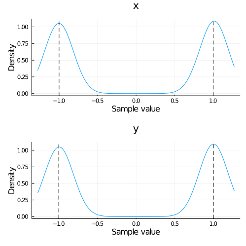

# NestedSamplers.jl

[](https://github.com/turinglang/NestedSamplers.jl/actions)
[](https://juliaci.github.io/NanosoldierReports/pkgeval_badges/report.html)
[](https://codecov.io/gh/turinglang/NestedSamplers.jl)

[](https://doi.org/10.5281/zenodo.3950594)

A Julian implementation of single- and multi-ellipsoidal nested sampling algorithms using the [AbstractMCMC](https://github.com/turinglang/abstractmcmc.jl) interface.

This package was heavily influenced by [`nestle`](https://github.com/kbarbary/nestle), [`dynesty`](https://github.com/joshspeagle/dynesty), and [`NestedSampling.jl`](https://github.com/kbarbary/NestedSampling.jl).


## Installation

To use the nested samplers first install this library

```julia
julia> ]add NestedSamplers
```


## Usage

The samplers are built using the [AbstractMCMC](https://github.com/turinglang/abstractmcmc.jl) interface. To use it, we need to create a `NestedModel`.


```julia
using Distributions
using LinearAlgebra
using NestedSamplers
using StatsFuns: logaddexp

# Gaussian mixture model
σ = 0.1
μ1 = ones(2)
μ2 = -ones(2)
inv_σ = diagm(0 => fill(1 / σ^2, 2))

function logl(x)
    dx1 = x .- μ1
    dx2 = x .- μ2
    f1 = -dx1' * (inv_σ * dx1) / 2
    f2 = -dx2' * (inv_σ * dx2) / 2
    return logaddexp(f1, f2)
end
priors = [
    Uniform(-5, 5),
    Uniform(-5, 5)
]
# or equivalently
prior_transform(X) = 10 .* X .- 5
# create the model
model = NestedModel(logl, priors); # or model = NestedModel(logl, prior_transform)
```


now, we set up our sampling using [StatsBase](https://github.com/JuliaStats/StatsBase.jl).

**Important:  the state of the sampler is returned in addition to the chain by `sample`.**

```julia
using StatsBase: sample, Weights

# create our sampler
# 2 parameters, 1000 active points, multi-ellipsoid. See docstring
spl = Nested(2, 1000)
# by default, uses dlogz for convergence. Set the keyword args here
# currently Chains and Array are support chain_types
chain, state = sample(model, spl; dlogz=0.2, param_names=["x", "y"])
# optionally resample the chain using the weights
chain_res = sample(chain, Weights(vec(chain["weights"])), length(chain));
```


let's take a look at the resampled posteriors

```julia
using StatsPlots
density(chain_res)
# analytical posterior maxima
vline!([-1, 1], c=:black, ls=:dash, subplot=1)
vline!([-1, 1], c=:black, ls=:dash, subplot=2)
```




and compare our estimate of the Bayesian (log-)evidence to the analytical value
```julia
analytic_logz = log(4π * σ^2 / 100)
# within 2-sigma
@assert isapprox(analytic_logz, state.logz, atol=2state.logzerr)
```


## API/Reference

### Samplers

```
NestedModel(loglike, prior_transform)
NestedModel(loglike, priors::AbstractVector{<:Distribution})
```

`loglike` must be callable with a signature `loglike(::AbstractVector)` where the length of the vector must match the number of parameters in your model.

`prior_transform` must be a callable with a signature `prior_transform(::AbstractVector)` that returns the transformation from the unit-cube to parameter space. This is effectively the quantile or ppf of a statistical distribution. For convenience, if a vector of `Distribution` is provided (as a set of priors), a transformation function will automatically be constructed using `Distributions.quantile`.

**Note:** `loglike` is the only function used for likelihood calculations. This means if you want your priors to be used for the likelihood calculations they must be manually included in the `loglike` function.


---

```
Nested(ndims, nactive;
    bounds=Bounds.MultiEllipsoid,
    proposal=:auto,
    enlarge=1.25,
    update_interval=default_update_interval(proposal, ndims),
    min_ncall=2nactive,
    min_eff=0.10)
```

Static nested sampler with `nactive` active points and `ndims` parameters.

`ndims` is equivalent to the number of parameters to fit, which defines the dimensionality of the prior volume used in evidence sampling. `nactive` is the number of live or active points in the prior volume. This is a static sampler, so the number of live points will be constant for all of the sampling.

## Bounds and Proposals

`bounds` declares the Type of [`Bounds.AbstractBoundingSpace`](@ref) to use in the prior volume. The available bounds are described by [`Bounds`](@ref). `proposal` declares the algorithm used for proposing new points. The available proposals are described in [`Proposals`](@ref). If `proposal` is `:auto`, will choose the proposal based on `ndims`

  * `ndims < 10` - [`Proposals.Uniform`](@ref)
  * `10 ≤ ndims ≤ 20` - [`Proposals.RWalk`](@ref)
  * `ndims > 20` - [`Proposals.Slice`](@ref)

The original nested sampling algorithm is roughly equivalent to using `Bounds.Ellipsoid` with `Proposals.Uniform`. The MultiNest algorithm is roughly equivalent to `Bounds.MultiEllipsoid` with `Proposals.Uniform`. The PolyChord algorithm is roughly equivalent to using `Proposals.RSlice`.

## Other Parameters

  * `enlarge` - When fitting the bounds to live points, they will be enlarged (in terms of volume) by this linear factor.
  * `update_interval` - How often to refit the live points with the bounds as a fraction of `nactive`. By default this will be determined using `default_update_interval` for the given proposal

      * `Proposals.Uniform` - `1.5`
      * `Proposals.RWalk` and `Proposals.RStagger` - `0.15 * walks`
      * `Proposals.Slice` - `0.9 * ndims * slices`
      * `Proposals.RSlice` - `2 * slices`
  * `min_ncall` - The minimum number of iterations before trying to fit the first bound
  * `min_eff` - The maximum efficiency before trying to fit the first bound


---
### Bounds

```
NestedSamplers.Bounds
```

This module contains the different algorithms for bounding the prior volume.

The available implementations are

  * [`Bounds.NoBounds`](@ref) - no bounds on the prior volume (equivalent to a unit cube)
  * [`Bounds.Ellipsoid`](@ref) - bound using a single ellipsoid
  * [`Bounds.MultiEllipsoid`](@ref) - bound using multiple ellipsoids in an optimal cluster


---

```
Bounds.NoBounds([T=Float64], N)
```

Unbounded prior volume; equivalent to the unit cube in `N` dimensions.


---

```
Bounds.Ellipsoid([T=Float64], N)
Bounds.Ellipsoid(center::AbstractVector, A::AbstractMatrix)
```

An `N`-dimensional ellipsoid defined by

$$
(x - center)^T A (x - center) = 1
$$

where `size(center) == (N,)` and `size(A) == (N,N)`.


---

```
Bounds.MultiEllipsoid([T=Float64], ndims)
Bounds.MultiEllipsoid(::AbstractVector{Ellipsoid})
```

Use multiple [`Ellipsoid`](@ref)s in an optimal clustering to bound prior space. For more details about the bounding algorithm, see the extended help (`??Bounds.MultiEllipsoid`)


---
### Proposals


```
NestedSamplers.Proposals
```

This module contains the different algorithms for proposing new points within a bounding volume in unit space.

The available implementations are

  * [`Proposals.Uniform`](@ref) - samples uniformly within the bounding volume
  * [`Proposals.RWalk`](@ref) - random walks to a new point given an existing one
  * [`Proposals.RStagger`](@ref) - random staggering away to a new point given an existing one
  * [`Proposals.Slice`](@ref) - slicing away to a new point given an existing one
  * [`Proposals.RSlice`](@ref) - random slicing away to a new point given an existing one


---

```
Proposals.Uniform()
```

Propose a new live point by uniformly sampling within the bounding volume.


---

```
Proposals.RWalk(;ratio=0.5, walks=25, scale=1)
```

Propose a new live point by random walking away from an existing live point.

## Parameters

  * `ratio` is the target acceptance ratio
  * `walks` is the minimum number of steps to take
  * `scale` is the proposal distribution scale, which will update *between* proposals.


---

```
Proposals.RStagger(;ratio=0.5, walks=25, scale=1)
```

Propose a new live point by random staggering away from an existing live point.  This differs from the random walk proposal in that the step size here is exponentially adjusted to reach a target acceptance rate *during* each proposal, in addition to *between* proposals.

## Parameters

  * `ratio` is the target acceptance ratio
  * `walks` is the minimum number of steps to take
  * `scale` is the proposal distribution scale, which will update *between* proposals.


---

```
Proposals.Slice(;slices=5, scale=1)
```

Propose a new live point by a series of random slices away from an existing live point. This is a standard *Gibbs-like* implementation where a single multivariate slice is a combination of `slices` univariate slices through each axis.

## Parameters

  * `slices` is the minimum number of slices
  * `scale` is the proposal distribution scale, which will update *between* proposals.


---

```
Proposals.RSlice(;slices=5, scale=1)
```

Propose a new live point by a series of random slices away from an existing live point. This is a standard *random* implementation where each slice is along a random direction based on the provided axes.

## Parameters

  * `slices` is the minimum number of slices
  * `scale` is the proposal distribution scale, which will update *between* proposals.


---
### Convergence

 There are a few convergence criteria available, by default the `dlogz` criterion will be used.
* `dlogz=0.5` sample until the *fraction of the remaining evidence* is below the given value ([more info](https://dynesty.readthedocs.io/en/latest/overview.html#stopping-criteria)).
* `maxiter=Inf` stop after the given number of iterations
* `maxcall=Inf` stop after the given number of  log-likelihood function calls
* `maxlogl=Inf` stop after reaching the target log-likelihood
## Contributing
**Primary Author:** Miles Lucas ([@mileslucas](https://github.com/mileslucas))

Contributions are always welcome! Take a look at the [issues](https://github.com/turinglang/nestedsamplers.jl/issues) for ideas of open problems!

---

This file was generated from [README.jmd](docs/README.jmd) using [Weave.jl](https://github.com/JunoLab/Weave.jl)
